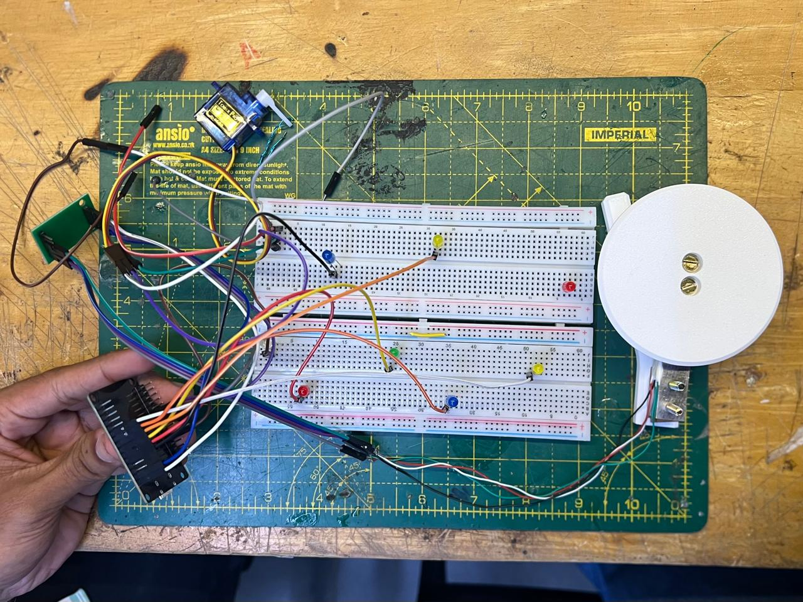

# LED Garden

## Basic Details
### Team Name: Fig Tree

### Team Members
- Member 1: Rida Kareem - NSS College of Engineering
- Member 2: Sidharth S - NSS College of Engineering

### Project Description
A water bottle holder embelished with a whimsical tech garden that obsessively reminds you to drink your water.
### The Problem (that doesn't exist)
There's no one who cares about our dehydratied existence. Everyone says that they care but then why do they have the time of their life when we are dying with thirst.

### The Solution (that nobody asked for)
Our garden full of whimsical LED flowers and flapping servomotor that care a little too much about you. When you drink enough water they bloom and fly around and right when you leave the water bottle down for less than a minute it dies, they lose all of their joy. When you see this cuties suffering, you will end your suffering too. As soon as the water bottle is back the kitschy, noisy garden is back.

## Technical Details
A load cell mounted on our 3d printed water bottle holder measures the weight of the bottle and time spend on the holder simultaneously. If you leave it there for 20 second the garden(breadboard) adorned with LEDS and Servomotor assisted butterfly reacts to your lack of proper dehydration since they are connected through an ESP32. The LEDS dim and the butterfly gradually stops flapping it's paper wings when the bottle is kept too long. After you took the bottle out and put it back, we calculate the difference in weight to estimate the water consumed and let's the garden come alive again. Until you keep it there long enough. Loadcell is calibrated accurately through various trial and error this gives reliable data about your water consumption. Still don't you wanna lighten up the LEDS by just taking your water in?! :)

## For Hardware:
[List main components]:

- ESP32
- Load Cell
- LEDs
- Servo Motor
- Arduino UNO (to power motor)
- HX711 (to amplify the load cell)
- Jumper Wires

| Component | Specification |
|-----------|----------------|
| ESP32 Dev Module | ESP32-D0WD-V3, dual-core, up to 240 MHz, 3.3 V logic |
| Servo Motor | SG90-type micro servo, 5 V, ~180° rotation |
| Load Cell | 5 kg strain-gauge load cell |
| HX711 | 24-bit ADC/load-cell amplifier, 2.6-5.5 V supply |
| LEDs | 8 x LEDs, individually PWM controlled |
| LED Resistors | 220-330 Ω per LED |
| Servo Signal | GPIO 26 |
| HX711 DT | GPIO 32 |
| HX711 SCK | GPIO 33 |
| LED GPIOs | 4, 5, 13, 14, 16, 17, 18, 19 |
| Servo PWM | 50 Hz |
| Servo movement | 60°-150° |
| LED PWM | 8-bit, 0-255 brightness |
| Power | ESP32: 5 V USB / 3.3 V logic; Servo: 5 V |
| Communication | USB Serial, 115200 baud |

[List tools required]:
  
- ESP32 Dev Module
- SG90 Servo Motor
- 3 kg Load Cell
- HX711 Load Cell Amplifier
- 8 x LEDs
- 8 x 220 Ω Resistors
- Breadboard(s)
- Jumper Wires
- USB Cable for ESP32
- Arduino UNO (for providing 5 V power to the servo)
- Butterfly wings/body made from paper
- Hot glue
- Soldering iron and solder

## For Hardware:

# Schematic & Circuit

# Build Photos

### Project Demo
# Video
[Add your demo video link here]
*Explain what the video demonstrates*

# Additional Demos
[Add any extra demo materials/links]

## Team Contributions
- [Name 1]: [Specific contributions]
- [Name 2]: [Specific contributions]
- [Name 3]: [Specific contributions]

---
Made with ❤️ at TinkerHub Useless Projects 

